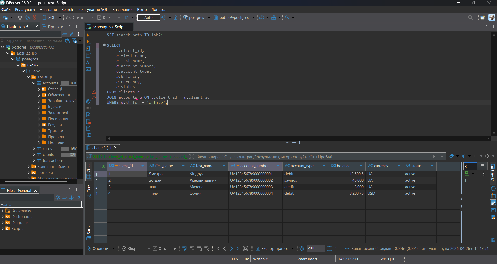
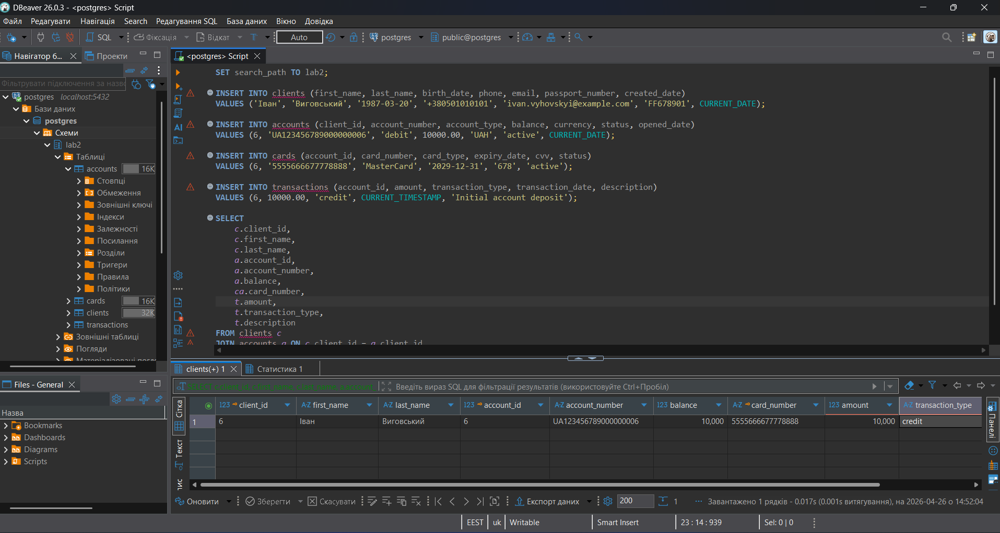
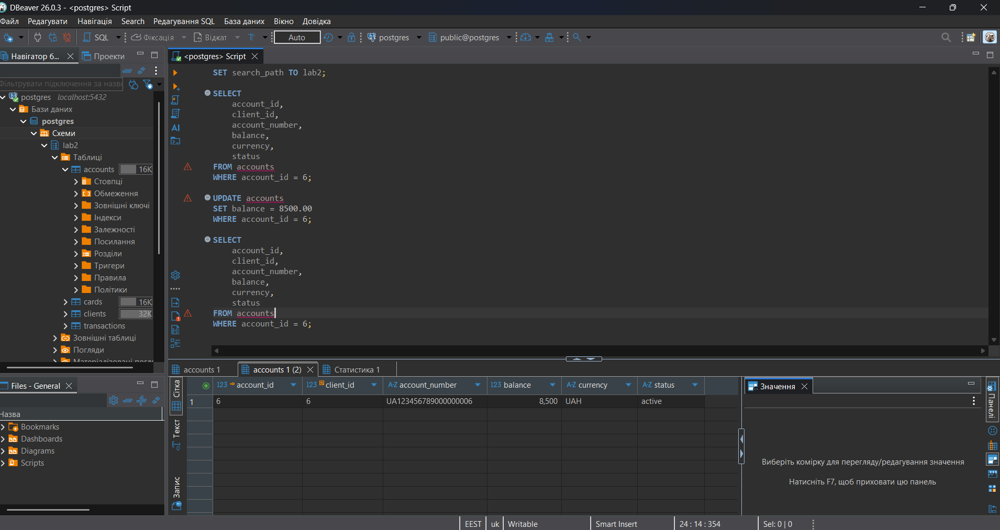
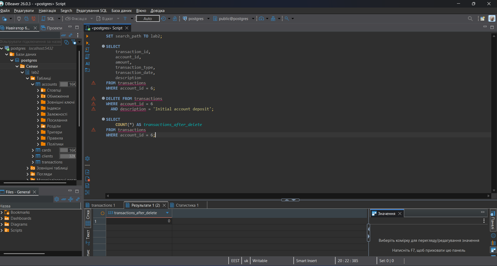

## Структура

У роботі використано такі SQL-скрипти:

- `scripts/select.sql` — вибірка активних рахунків клієнтів;
- `scripts/insert.sql` — додавання нового клієнта, рахунку, картки та транзакції;
- `scripts/update.sql` — оновлення балансу рахунку;
- `scripts/delete.sql` — видалення тестової транзакції.

## 1. SELECT-запит

Файл:

```text
scripts/select.sql
```

Мета запиту — отримати список активних банківських рахунків разом з інформацією про клієнтів.

У запиті використано:

- вибір конкретних стовпців;
- `JOIN` між таблицями `clients` та `accounts`;
- фільтрацію через `WHERE a.status = 'active'`.

Результат виконання збережено у файлі:

```text
screenshots/select_active_accounts.png
```



## 2. INSERT-запити

Файл:

```text
scripts/insert.sql
```

Мета запитів — додати нового тестового клієнта до банківської системи.

Було додано:

- нового клієнта Івана Виговського у таблицю `clients`;
- новий банківський рахунок у таблицю `accounts`;
- нову картку у таблицю `cards`;
- початкову транзакцію у таблицю `transactions`.

Після виконання `INSERT` було виконано перевірочний `SELECT`, який показав доданого клієнта, його рахунок, картку та транзакцію.

Результат збережено у файлі:

```text
screenshots/insert_new_client.png
```



## 3. UPDATE-запит

Файл:

```text
scripts/update.sql
```

Мета запиту — змінити баланс рахунку нового клієнта.

Перед оновленням було виконано `SELECT`, щоб перевірити початковий стан рахунку. Потім за допомогою `UPDATE` баланс рахунку було змінено на `8500.00`.

Оновлення виконано безпечно, оскільки використано:

```sql
WHERE account_number = 'UA123456789000000006'
```

Після оновлення було виконано повторний `SELECT`, який підтвердив зміну балансу.

Результат збережено у файлі:

```text
screenshots/update_account_balance.png
```



## 4. DELETE-запит

Файл:

```text
scripts/delete.sql
```

Мета запиту — видалити тестову транзакцію для нового рахунку.

Перед видаленням було виконано `SELECT`, щоб перевірити, яка транзакція буде видалена. Потім було виконано `DELETE` з умовою `WHERE`, щоб не видалити зайві записи.

Після видалення виконано перевірочний запит:

```sql
SELECT COUNT(*) AS transactions_after_delete
FROM transactions
WHERE account_id = (
    SELECT account_id 
    FROM accounts 
    WHERE account_number = 'UA123456789000000006'
);
```

Результат показав `0`, тобто тестову транзакцію було успішно видалено.

Результат збережено у файлі:

```text
screenshots/delete_transaction.png
```



## Висновок

Під час виконання лабораторної роботи я створив запити для вибірки даних, додавання нових записів, оновлення існуючих записів та безпечного видалення даних.

Для операцій `UPDATE` і `DELETE` використовувалася умова `WHERE`, що дозволило змінювати лише потрібні записи та не зачіпати інші дані в таблицях.

Результати виконання запитів були перевірені у DBeaver та збережені у вигляді скріншотів.