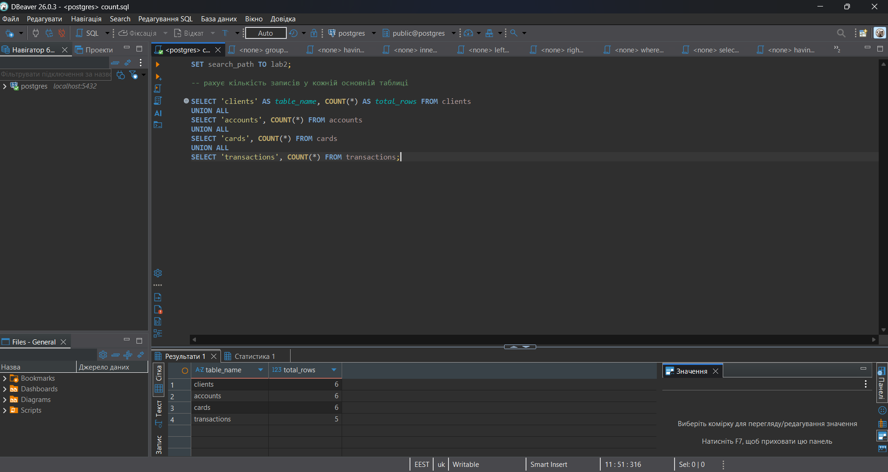
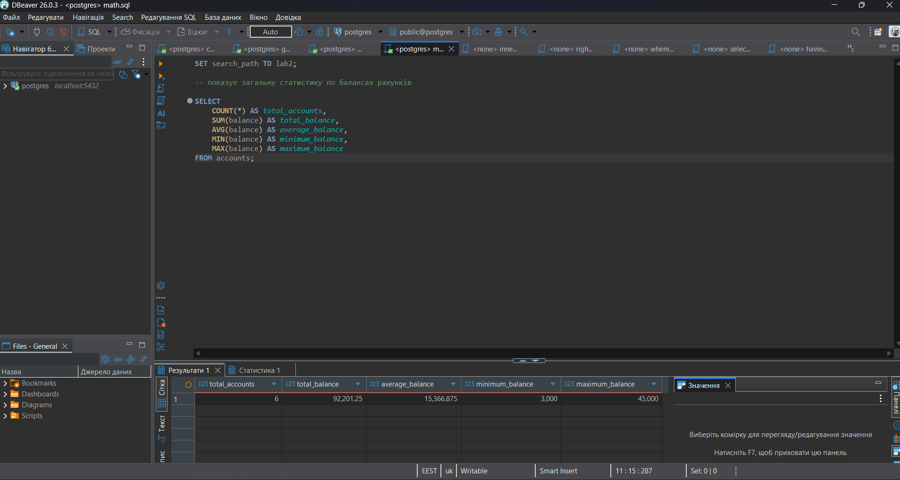
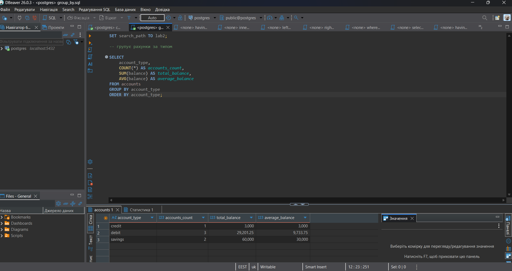
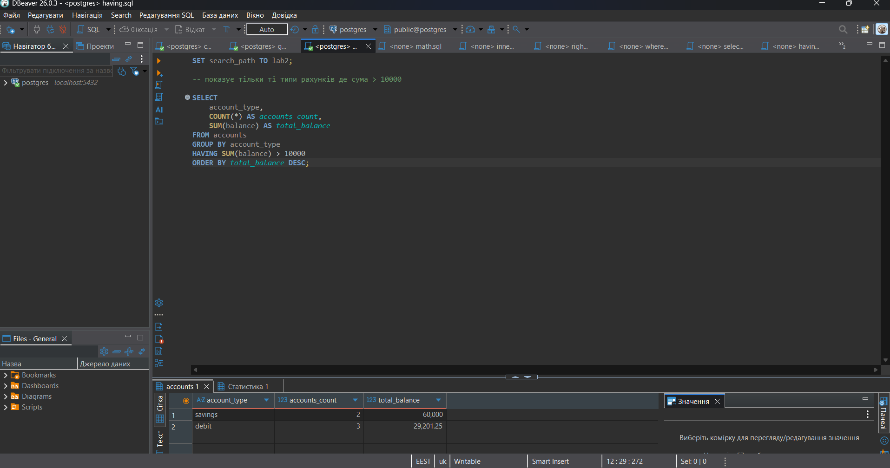
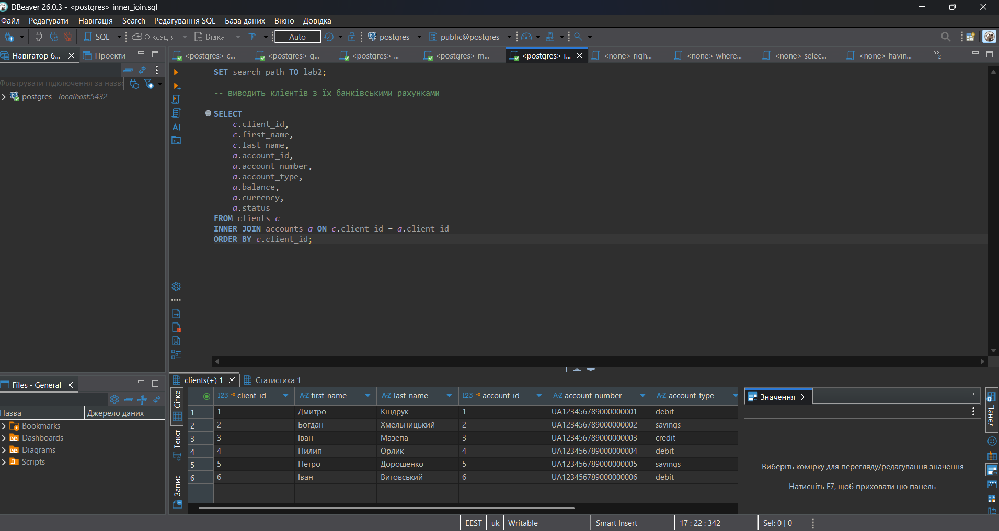
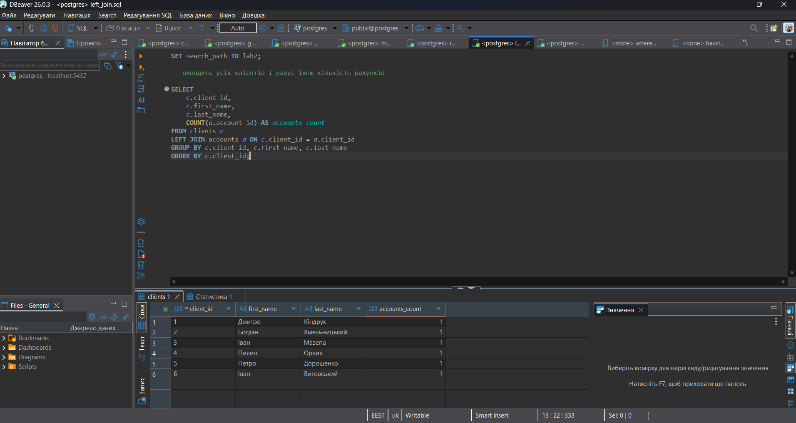
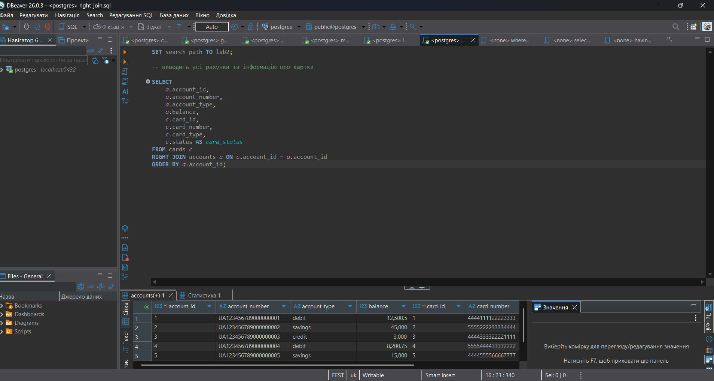
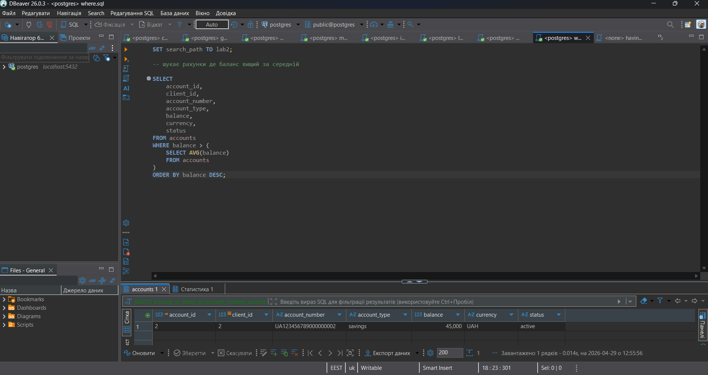
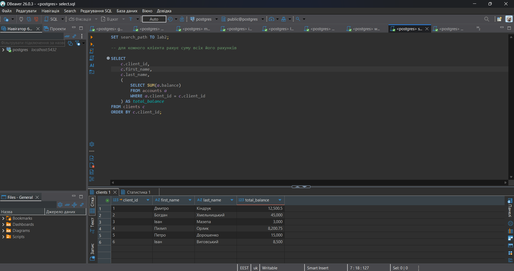
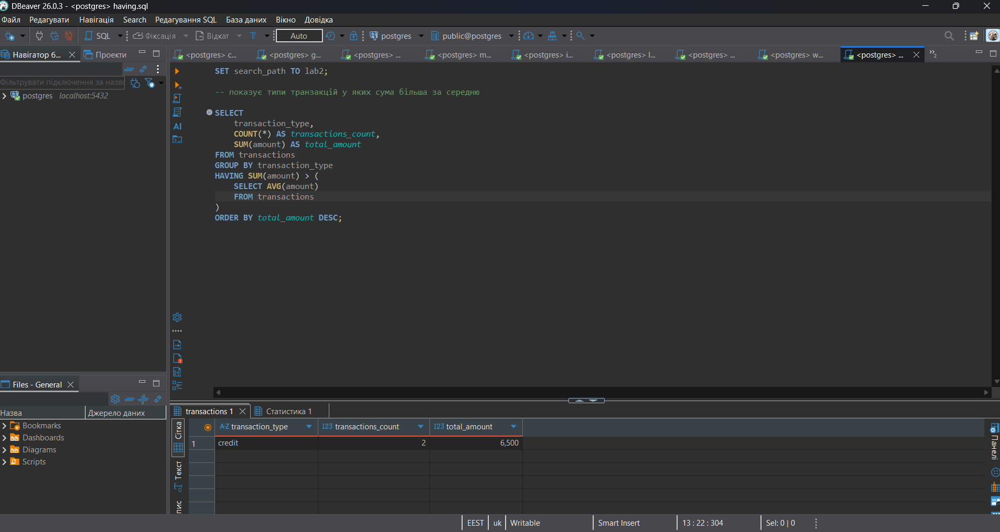

## Агрегаційні запити

У папці `scripts/aggregations` розміщено 4 SQL-запити з використанням агрегатних функцій:

### Запит `count.sql`

Файл:

```text
scripts/aggregations/count.sql
```

Мета запиту: підрахувати кількість записів у кожній основній таблиці бази даних: `clients`, `accounts`, `cards`, `transactions`.

У запиті використовується агрегатна функція:

```sql
COUNT(*)
```

Результат виконання збережено у файлі:

```text
screenshots/aggregations/count.png
```



### Запит `math.sql`

Файл:

```text
scripts/aggregations/math.sql
```

Мета запиту: отримати загальну статистику балансів на рахунках.

У запиті використовуються агрегатні функції:

```sql
COUNT()
SUM()
AVG()
MIN()
MAX()
```

Результат виконання збережено у файлі:

```text
screenshots/aggregations/math.png
```



### Запит `group_by.sql`

Файл:

```text
scripts/aggregations/group_by.sql
```

Мета запиту: згрупувати рахунки за типом рахунку та порахувати статистику для кожного типу.

У запиті використано:

- `GROUP BY`;
- `COUNT`;
- `SUM`;
- `AVG`.

Результат виконання збережено у файлі:

```text
screenshots/aggregations/group_by.png
```



### Запит `having.sql`

Файл:

```text
scripts/aggregations/having.sql
```

Мета запиту: показати тільки ті типи рахунків, у яких загальна сума балансів більша за задане значення.

У запиті використано:

- `GROUP BY`;
- `HAVING`;
- `SUM`;
- `COUNT`.

Результат виконання збережено у файлі:

```text
screenshots/aggregations/having.png
```



## JOIN-запити

У папці `scripts/joins` розміщено 3 SQL-запити з різними типами з’єднань таблиць:

### Запит `inner_join.sql`

Файл:

```text
scripts/joins/inner_join.sql
```

Мета запиту: вивести клієнтів разом з їхніми банківськими рахунками.

У запиті використано:

```sql
INNER JOIN
```

Результат виконання збережено у файлі:

```text
screenshots/joins/inner_join.png
```



### Запит `left_join.sql`

Файл:

```text
scripts/joins/left_join.sql
```

Мета запиту: показати всіх клієнтів і кількість їхніх рахунків.

У запиті використано:

```sql
LEFT JOIN
```

Результат виконання збережено у файлі:

```text
screenshots/joins/left_join.png
```



### Запит `right_join.sql`

Файл:

```text
scripts/joins/right_join.sql
```

Мета запиту: показати всі рахунки та інформацію про пов’язані з ними картки.

У запиті використано:

```sql
RIGHT JOIN
```

Результат виконання збережено у файлі:

```text
screenshots/joins/right_join.png
```



## Запити з підзапитами

У папці `scripts/requests` розміщено 3 SQL-запити з підзапитами:

### Запит `where.sql`

Файл:

```text
scripts/requests/where.sql
```

Мета запиту: знайти рахунки, баланс яких більший за середній баланс усіх рахунків.

У цьому запиті підзапит використано:

```sql
WHERE
```

Результат виконання збережено у файлі:

```text
screenshots/requests/where.png
```



### Запит `select.sql`

Файл:

```text
scripts/requests/select.sql
```

Мета запиту: показати кожного клієнта та загальну суму балансів його рахунків.

У цьому запиті підзапит використано:

```sql
SELECT
```

Результат виконання збережено у файлі:

```text
screenshots/requests/select.png
```



### Запит `having.sql`

Файл:

```text
scripts/requests/having.sql
```

Мета запиту: згрупувати транзакції за типом і показати тільки ті групи, де загальна сума більша за середню суму у транзакціях.

У цьому запиті підзапит використано:

```sql
HAVING
```

Результат виконання збережено у файлі:

```text
screenshots/requests/having.png
```



## Висновок

Під час виконання лабораторної роботи було виконано аналітичні SQL-запити для бази даних мого прототипу банківської системи.
Було створено 4 агрегаційні запити, які використовують функції `COUNT`, `SUM`, `AVG`, `MIN`, `MAX`, а також оператори `GROUP BY` і `HAVING`.
Також було використано 3 запити з різними типами з’єднань таблиць: `INNER JOIN`, `LEFT JOIN` і `RIGHT JOIN`.
Окремо було реалізовано 3 запити з підзапитами у секціях `WHERE`, `SELECT` та `HAVING`.
Усі запити були виконані без помилок, що демонструють мої скріншоти.
