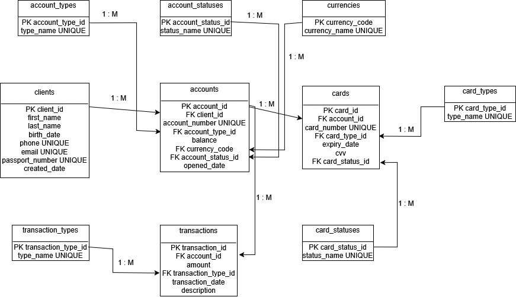

## Початкова схема бази даних:

## Таблиця `clients`

Таблиця зберігала інформацію про клієнтів банку.

```text
clients
-------------------------
PK client_id
first_name
last_name
birth_date
phone UNIQUE
email UNIQUE
passport_number UNIQUE
created_date
```

У цій таблиці кожен клієнт має унікальний ідентифікатор `client_id`. Також унікальними є номер телефону, email та номер паспорта.


## Таблиця `accounts`

Таблиця зберігала інформацію про рахунки клієнтів.

У цій таблиці були повторювані значення в полях: `account_type`, `currency` та `status`.

```text
accounts
-------------------------
PK account_id
FK client_id
account_number UNIQUE
account_type
balance
currency
status
opened_date
```

Проблема цієї таблиці полягає в тому, що тип рахунку, валюта та статус зберігалися як текстові значення безпосередньо в таблиці `accounts`. Наприклад, значення: `debit`, `credit`, `savings`, `UAH`, `USD`, `EUR`, `active`, `blocked` повторювалися у багатьох рядках.


## Таблиця `cards`

Таблиця зберігала інформацію про банківські картки.

У цій таблиці були повторювані значення в полях: `card_type` та `status`.

```text
cards
-------------------------
PK card_id
FK account_id
card_number UNIQUE
card_type
expiry_date
cvv
status
```

Проблема цієї таблиці полягає в тому, що тип картки та статус картки зберігалися як текстові значення. Наприклад, значення `Visa`, `MasterCard`, `active`, `expired`, `blocked` могли повторюватися в багатьох рядках.


## Таблиця `transactions`

Таблиця зберігала інформацію про фінансові операції.

У цій таблиці було повторюване значення в полі `transaction_type`.

```text
transactions
-------------------------
PK transaction_id
FK account_id
amount
transaction_type
transaction_date
description
```

Проблема таблиці полягає в тому, що тип транзакції `debit` або `credit` зберігався безпосередньо у кожному рядку таблиці.


## Виявлені проблеми:

У початковій схемі частина значень зберігалася повторно, що могло створити плутанину у достовірності даних.

Повторювані значення:

```text
accounts.account_type
accounts.currency
accounts.status
cards.card_type
cards.status
transactions.transaction_type
```

Можливі проблеми:

- якщо потрібно змінити назву статусу рахунку, її доведеться змінювати у багатьох рядках;
- можна випадково записати однакове значення по-різному, наприклад `active` і `Active`;
- неможливо зручно зберігати перелік допустимих типів або статусів окремо від основних таблиць;
- порушується принцип, за яким кожен факт повинен зберігатися лише один раз.


## Функціональні залежності початкової схеми:

## Таблиця `clients`

Функціональні залежності:

```text
client_id -> first_name, last_name, birth_date, phone, email, passport_number, created_date
phone -> client_id
email -> client_id
passport_number -> client_id
```

Первинний ключ: `client_id`.

Альтернативні унікальні ключі: `phone`, `email`, `passport_number`.


## Таблиця `accounts`

Функціональні залежності:

```text
account_id -> client_id, account_number, account_type, balance, currency, status, opened_date
account_number -> account_id, client_id, account_type, balance, currency, status, opened_date
account_type -> allowed account type value
currency -> currency meaning
status -> account status meaning
```

Первинний ключ: `account_id`.

Альтернативний унікальний ключ: `account_number`.

Проблемні атрибути: `account_type`, `currency`, `status`.


## Таблиця `cards`

Функціональні залежності:

```text
card_id -> account_id, card_number, card_type, expiry_date, cvv, status
card_number -> card_id, account_id, card_type, expiry_date, cvv, status
card_type -> allowed card type value
status -> card status meaning
```

Первинний ключ: `card_id`.

Альтернативний унікальний ключ: `card_number`.

Проблемні атрибути: `card_type`, `status`.


## Таблиця `transactions`

Функціональні залежності:

```text
transaction_id -> account_id, amount, transaction_type, transaction_date, description
transaction_type -> allowed transaction type value
```

Первинний ключ: `transaction_id`.

Проблемний атрибут: `transaction_type`.


## Аналіз нормальних форм:

## 1НФ

Початкова схема відповідає 1НФ, оскільки всі атрибути є атомарними. У таблицях немає полів, які містять списки значень або повторювані групи в одному стовпці.

Наприклад, `phone`, `email`, `account_number`, `account_type`, `currency`, `status` зберігаються як окремі значення.


## 2НФ

Початкова схема відповідає 2НФ, оскільки всі основні таблиці мають прості первинні ключі, а не складені. Через це немає часткових залежностей від частини складеного ключа.

Наприклад, у таблиці `accounts` первинним ключем є один атрибут `account_id`, тому всі інші атрибути залежать від усього ключа.


## 3НФ

Початкова схема не повністю відповідає 3НФ, оскільки в таблицях є повторювані довідникові значення. Такі значення краще винести в окремі таблиці, щоб уникнути дублювання та аномалій оновлення.

Для приведення схеми до 3НФ я створив довідникові таблиці, а в основних таблицях замість текстових значень використані зовнішні ключі.


## Нормалізація таблиць:

## `accounts`

Початковий дизайн:

```text
accounts(account_id, client_id, account_number, account_type, balance, currency, status, opened_date)
```

Проблема:

```text
account_type, currency, status
```

Ці атрибути містили повторювані значення.

Запропоновані нові таблиці:

```text
account_types(account_type_id, type_name)
account_statuses(account_status_id, status_name)
currencies(currency_code, currency_name)
```

Нова таблиця `accounts`:

```text
accounts(account_id, client_id, account_number, account_type_id, balance, currency_code, account_status_id, opened_date)
```

Логічні команди зміни структури:

```sql
ALTER TABLE accounts
    ADD COLUMN account_type_id INTEGER;

ALTER TABLE accounts
    ADD COLUMN account_status_id INTEGER;

ALTER TABLE accounts
    ADD COLUMN currency_code CHAR(3);

ALTER TABLE accounts
    DROP COLUMN account_type;

ALTER TABLE accounts
    DROP COLUMN status;

ALTER TABLE accounts
    DROP COLUMN currency;
```

Зміна усуває аномалію, тому що типи рахунків, статуси та валюти тепер зберігаються один раз у довідникових таблицях, а таблиця `accounts` лише посилається на них через зовнішні ключі.


## `cards`

Початковий дизайн:

```text
cards(card_id, account_id, card_number, card_type, expiry_date, cvv, status)
```

Проблема:

```text
card_type, status
```

Ці атрибути містили повторювані значення.

Запропоновані нові таблиці:

```text
card_types(card_type_id, type_name)
card_statuses(card_status_id, status_name)
```

Нова таблиця `cards`:

```text
cards(card_id, account_id, card_number, card_type_id, expiry_date, cvv, card_status_id)
```

Логічні команди зміни структури:

```sql
ALTER TABLE cards
    ADD COLUMN card_type_id INTEGER;

ALTER TABLE cards
    ADD COLUMN card_status_id INTEGER;

ALTER TABLE cards
    DROP COLUMN card_type;

ALTER TABLE cards
    DROP COLUMN status;
```

Зміна усуває дублювання, тому що типи та статуси карток зберігаються в окремих таблицях.


## `transactions`

Початковий дизайн:

```text
transactions(transaction_id, account_id, amount, transaction_type, transaction_date, description)
```

Проблема:

```text
transaction_type
```

Цей атрибут містив повторювані значення.

Запропонована нова таблиця:

```text
transaction_types(transaction_type_id, type_name)
```

Нова таблиця `transactions`:

```text
transactions(transaction_id, account_id, amount, transaction_type_id, transaction_date, description)
```

Логічні команди зміни структури:

```sql
ALTER TABLE transactions
    ADD COLUMN transaction_type_id INTEGER;

ALTER TABLE transactions
    DROP COLUMN transaction_type;
```

Зміна усуває дублювання, тому що тип транзакції тепер зберігається в окремій таблиці `transaction_types`.


## Перероблена схема бази даних

Після нормалізації схема містить основні таблиці та довідникові таблиці.

Основні таблиці:

```text
clients
accounts
cards
transactions
```

Довідникові таблиці:

```text
account_types
account_statuses
currencies
card_types
card_statuses
transaction_types
```


## SQL-реалізація нормалізованої схеми:

Перероблена схема реалізована за допомогою окремих SQL-файлів у папці `scripts`.

```text
scripts/create_schema.sql
scripts/lookup_tables.sql
scripts/main_tables.sql
scripts/insert_data.sql
scripts/check_schema.sql
```

Файл `create_schema.sql` створює схему `lab5`.

Файл `lookup_tables.sql` містить SQL-інструкції `CREATE TABLE` для довідникових таблиць:

```text
account_types(account_type_id, type_name)
account_statuses(account_status_id, status_name)
currencies(currency_code, currency_name)
card_types(card_type_id, type_name)
card_statuses(card_status_id, status_name)
transaction_types(transaction_type_id, type_name)
```

Файл `main_tables.sql` містить SQL-інструкції `CREATE TABLE` для основних таблиць:

```text
clients(client_id, first_name, last_name, birth_date, phone, email, passport_number, created_date)
accounts(account_id, client_id, account_number, account_type_id, balance, currency_code, account_status_id, opened_date)
cards(card_id, account_id, card_number, card_type_id, expiry_date, cvv, card_status_id)
transactions(transaction_id, account_id, amount, transaction_type_id, transaction_date, description)
```

Файл `insert_data.sql` заповнює довідникові та основні таблиці тестовими даними.

Файл `check_schema.sql` перевіряє роботу нормалізованої схеми через `SELECT`-запити з `JOIN`.

Повний SQL-код з командами `CREATE TABLE`, первинними ключами, зовнішніми ключами та обмеженнями знаходиться в окремих файлах папки `scripts`.


## Структура таблиць у 3НФ:

## `clients`

```text
PK client_id
first_name
last_name
birth_date
phone UNIQUE
email UNIQUE
passport_number UNIQUE
created_date
```

## `accounts`

```text
PK account_id
FK client_id
account_number UNIQUE
FK account_type_id
balance
FK currency_code
FK account_status_id
opened_date
```

## `cards`

```text
PK card_id
FK account_id
card_number UNIQUE
FK card_type_id
expiry_date
cvv
FK card_status_id
```

## `transactions`

```text
PK transaction_id
FK account_id
amount
FK transaction_type_id
transaction_date
description
```

## `account_types`

```text
PK account_type_id
type_name UNIQUE
```

## `account_statuses`

```text
PK account_status_id
status_name UNIQUE
```

## `currencies`

```text
PK currency_code
currency_name UNIQUE
```

## `card_types`

```text
PK card_type_id
type_name UNIQUE
```

## `card_statuses`

```text
PK card_status_id
status_name UNIQUE
```

## `transaction_types`

```text
PK transaction_type_id
type_name UNIQUE
```


## ER-діаграма

```text
visual/ERdiagram.jpg
```



На діаграмі показано всі основні та довідникові таблиці, а також зв’язки між ними.


## Зв’язки між таблицями:

1. `clients.client_id` → `accounts.client_id`

   - один клієнт може мати багато рахунків;

2. `accounts.account_id` → `cards.account_id`

   - один рахунок може мати багато карток;

3. `accounts.account_id` → `transactions.account_id`

   - один рахунок може мати багато транзакцій;

4. `account_types.account_type_id` → `accounts.account_type_id`

   - один тип рахунку може використовуватися в багатьох рахунках;

5. `account_statuses.account_status_id` → `accounts.account_status_id`

   - один статус рахунку може використовуватися в багатьох рахунках;

6. `currencies.currency_code` → `accounts.currency_code`

   - одна валюта може використовуватися в багатьох рахунках;

7. `card_types.card_type_id` → `cards.card_type_id`

   - один тип картки може використовуватися в багатьох картках;

8. `card_statuses.card_status_id` → `cards.card_status_id`

   - один статус картки може використовуватися в багатьох картках;

9. `transaction_types.transaction_type_id` → `transactions.transaction_type_id`

   - один тип транзакції може використовуватися в багатьох транзакціях.


## Висновок:

Під час виконання лабораторної роботи я проаналізував початкову схему банківської бази даних та виявив повторювані текстові значення в таблицях `accounts`, `cards` і `transactions`.

Для усунення надлишковості були створені окремі довідникові таблиці: `account_types`, `account_statuses`, `currencies`, `card_types`, `card_statuses` та `transaction_types`.

Після нормалізації основні таблиці більше не зберігають повторювані текстові значення, а використовують зовнішні ключі на довідникові таблиці. Це зменшує дублювання, покращує цілісність даних і знижує ризик аномалій оновлення.

Фінальна схема відповідає третій нормальній формі, оскільки всі неключові атрибути залежать від ключів своїх таблиць, а довідникові значення винесені в окремі таблиці.
