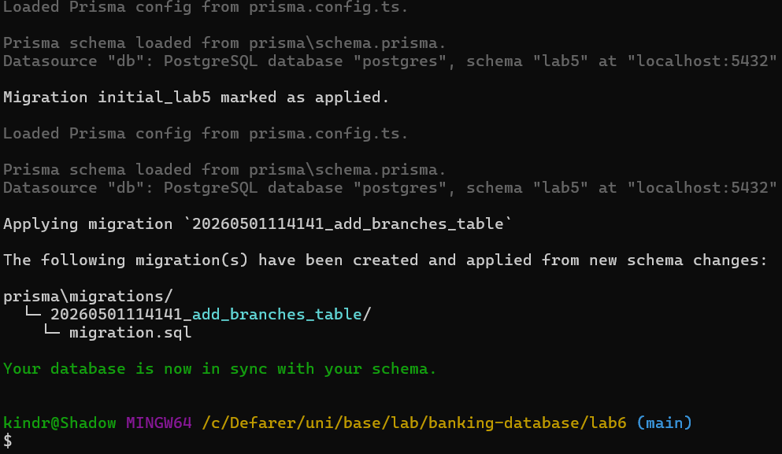
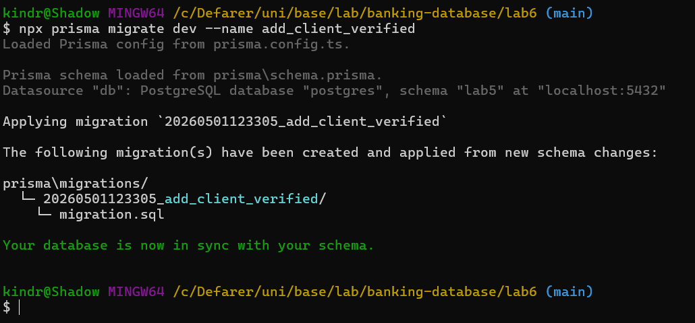
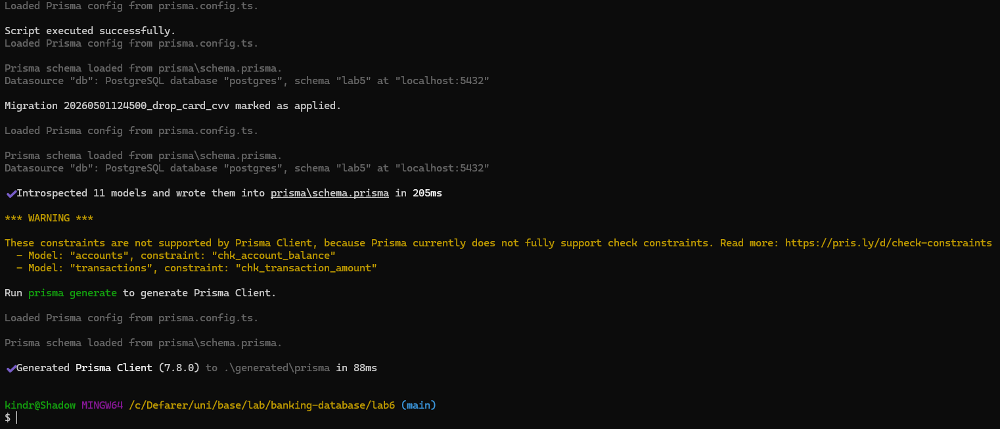
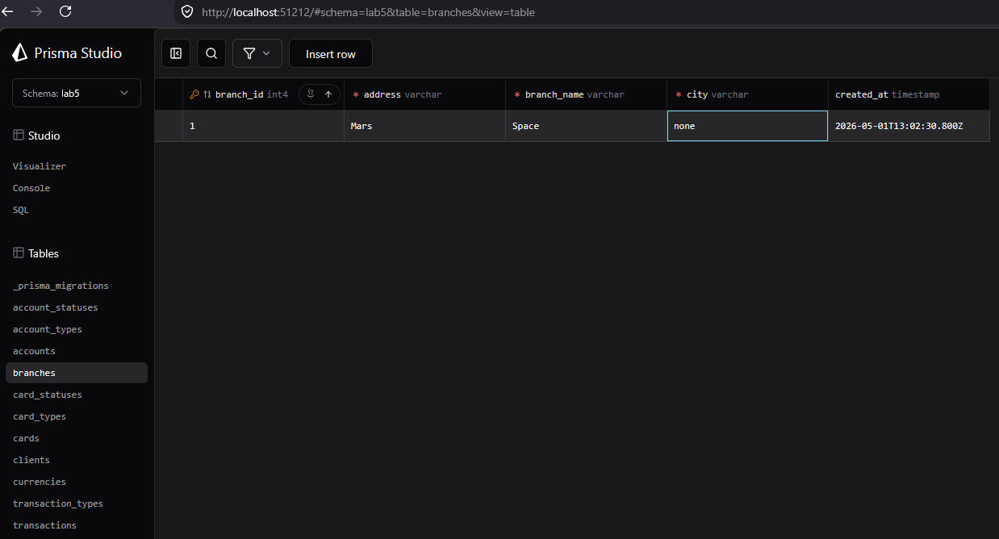
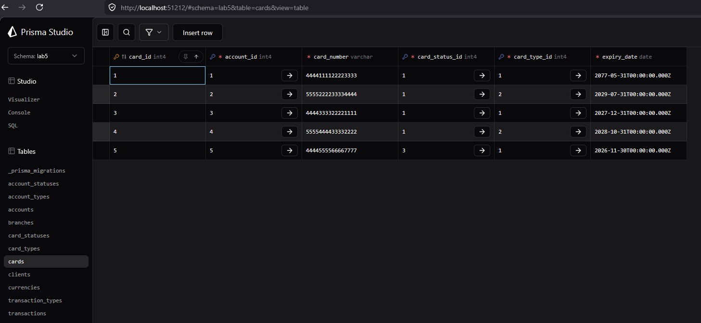
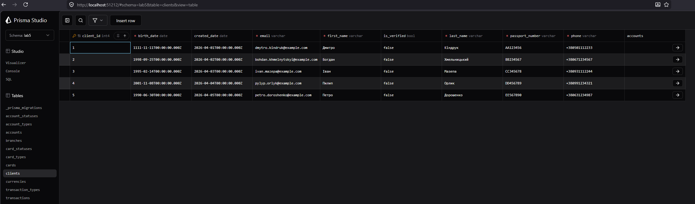

## Prisma

У папці `lab6` ми створили Node.js-проєкт та ініціалізували Prisma ORM.

Використані команди:

```bash
npm init -y
npm install prisma --save-dev
npx prisma init --datasource-provider postgresql
npm install dotenv
```

Після цього в проєкті з’явилися файли та папки:

```text
package.json
package-lock.json
.env
.gitignore
prisma/
prisma/schema.prisma
prisma.config.ts
```

Файл `.env` використовується локально для зберігання рядка підключення до бази даних.

У файлі `.gitignore` вказано:

```text
node_modules
.env
/generated/prisma
```

## Аналіз існуючої схеми

Для зчитування існуючої схеми `lab5` з PostgreSQL була виконана команда:

```bash
npx prisma db pull
```

Результат:

```text
Introspected 10 models and wrote them into prisma/schema.prisma
```

Це означає, що Prisma успішно зчитала таблиці зі схеми `lab5` та створила відповідні моделі у файлі `prisma/schema.prisma`.

Після імпорту були отримані моделі:

```text
account_statuses
account_types
accounts
card_statuses
card_types
cards
clients
currencies
transaction_types
transactions
```

## Початкова міграція `initial_lab5`

Оскільки база даних вже існувала до використання Prisma, то була створена початкова міграція для фіксації поточного стану схеми.

Назва міграції:

```text
initial_lab5
```

Файл міграції:

```text
prisma/migrations/initial_lab5/migration.sql
```

Для створення SQL-файлу початкової міграції було використано команду:

```bash
npx prisma migrate diff --from-empty --to-schema prisma/schema.prisma --script > prisma/migrations/initial_lab5/migration.sql
```

Після цього міграція була позначена як застосована:

```bash
npx prisma migrate resolve --applied initial_lab5
```

Ця міграція містить початкове створення схеми `lab5` та таблиць, які були отримані після лабораторної роботи 5.


## Міграція 1: додавання таблиці `branches`

Назва міграції:

```text
add_branches_table
```

Файл міграції:

```text
prisma/migrations/20260501114141_add_branches_table/migration.sql
```

Мета міграції: додати нову таблицю банківських відділень `branches`.

У файл `schema.prisma` була додана модель:

```prisma
model branches {
  branch_id   Int      @id @default(autoincrement())
  branch_name String   @unique @db.VarChar(100)
  city        String   @db.VarChar(50)
  address     String   @db.VarChar(150)
  created_at  DateTime @default(now()) @db.Timestamp(6)
}
```

Команда для застосування міграції:

```bash
npx prisma migrate dev --name add_branches_table
```

Результат виконання:

```text
Applying migration `20260501114141_add_branches_table`
Your database is now in sync with your schema.
```

Скріншот результату міграції:

```text
screenshots/add_branches_table.png
```




## Міграція 2: додавання поля `is_verified` у таблицю `clients`

Назва міграції:

```text
add_client_verified
```

Файл міграції:

```text
prisma/migrations/20260501123305_add_client_verified/migration.sql
```

Мета міграції: додати до таблиці `clients` нове поле, яке показує, чи клієнт підтверджений.

До моделі `clients` було додано поле:

```prisma
is_verified Boolean @default(false)
```

Фрагмент моделі після зміни:

```prisma
model clients {
  client_id       Int        @id @default(autoincrement())
  first_name      String     @db.VarChar(50)
  last_name       String     @db.VarChar(50)
  birth_date      DateTime   @db.Date
  phone           String     @unique @db.VarChar(20)
  email           String     @unique @db.VarChar(100)
  passport_number String     @unique @db.VarChar(20)
  created_date    DateTime   @default(dbgenerated("CURRENT_DATE")) @db.Date
  is_verified     Boolean    @default(false)
  accounts        accounts[]
}
```

Команда для застосування міграції:

```bash
npx prisma migrate dev --name add_client_verified
```

Результат виконання:

```text
Applying migration `20260501123305_add_client_verified`
Your database is now in sync with your schema.
```

Скріншот результату міграції:

```text
screenshots/add_client_verified.png
```




## Міграція 3: видалення поля `cvv` з таблиці `cards`

Назва міграції:

```text
drop_card_cvv
```

Файл міграції:

```text
prisma/migrations/20260501124500_drop_card_cvv/migration.sql
```

Мета міграції: видалити поле `cvv` з таблиці `cards`.

До зміни модель `cards` містила поле:

```prisma
cvv String @db.Char(3)
```

Після зміни це поле було видалено з моделі `cards`.

Фрагмент моделі після зміни:

```prisma
model cards {
  card_id        Int           @id @default(autoincrement())
  account_id     Int
  card_number    String        @unique @db.VarChar(20)
  card_type_id   Int
  expiry_date    DateTime      @db.Date
  card_status_id Int

  accounts      accounts      @relation(fields: [account_id], references: [account_id], onDelete: NoAction, onUpdate: NoAction, map: "fk_cards_accounts")
  card_statuses card_statuses @relation(fields: [card_status_id], references: [card_status_id], onDelete: NoAction, onUpdate: NoAction, map: "fk_cards_card_statuses")
  card_types    card_types    @relation(fields: [card_type_id], references: [card_type_id], onDelete: NoAction, onUpdate: NoAction, map: "fk_cards_card_types")
}
```

Через проблему з перевіркою shadow database ця міграція була створена вручну як SQL-файл і застосована через `prisma db execute`.

Вміст SQL-міграції:

```sql
SET search_path TO "lab5";

ALTER TABLE "cards"
DROP COLUMN IF EXISTS "cvv";
```

Команди застосування:

```bash
npx prisma db execute --file prisma/migrations/20260501124500_drop_card_cvv/migration.sql
npx prisma migrate resolve --applied 20260501124500_drop_card_cvv
npx prisma db pull
npx prisma generate
```

Результат виконання:

```text
Script executed successfully.
Migration 20260501124500_drop_card_cvv marked as applied.
Introspected 11 models and wrote them into prisma/schema.prisma
Generated Prisma Client
```

Скріншот результату міграції:

```text
screenshots/drop_card_cvv.png
```




## Перевірка через Prisma Studio

Для перевірки роботи схеми у Prisma Studio:

```bash
npx prisma studio
```

Через Prisma Studio було перевірено:

1. Наявність нової таблиці `branches`.
2. Успішне вставлення нового запису в таблицю `branches`.
3. Наявність нового поля `is_verified` у таблиці `clients`.
4. Відсутність поля `cvv` у таблиці `cards`.

У таблицю `branches` було додано тестовий запис:

```text
address: Mars
branch_name: Space
city: none
```

Після збереження Prisma Studio автоматично заповнила `branch_id` та `created_at`.

Скріншот таблиці `branches`:

```text
screenshots/ps_branches.png
```




## Перевірка таблиці `cards`

У Prisma Studio було відкрито таблицю `cards`. На скріншоті видно, що поле `cvv` більше не відображається.

Скріншот таблиці `cards`:

```text
screenshots/ps_cards.png
```




## Перевірка таблиці `clients`

У Prisma Studio було відкрито таблицю `clients`. На скріншоті видно нове поле `is_verified`, яке має значення `false` для існуючих клієнтів.

Скріншот таблиці `clients`:

```text
screenshots/ps_clients.png
```



## Висновок

Під час лабораторної роботи ми підключили Prisma ORM до існуючої бази даних PostgreSQL та виконали аналіз схеми `lab5`. Після цього було створено початкову міграцію, яка зафіксувала стан бази даних після попередніх лабораторних робіт. Далі було виконано три зміни схеми: додано таблицю `branches`, додано поле `is_verified` до таблиці `clients` та видалено поле `cvv` з таблиці `cards`. Результати були перевірені через Prisma Studio. Було підтверджено, що нова таблиця `branches` існує та приймає дані, поле `is_verified` з’явилося в таблиці `clients`, а поле `cvv` було видалене з таблиці `cards`. Тому робимо висновок, що все працює та робота виконано успішно.
